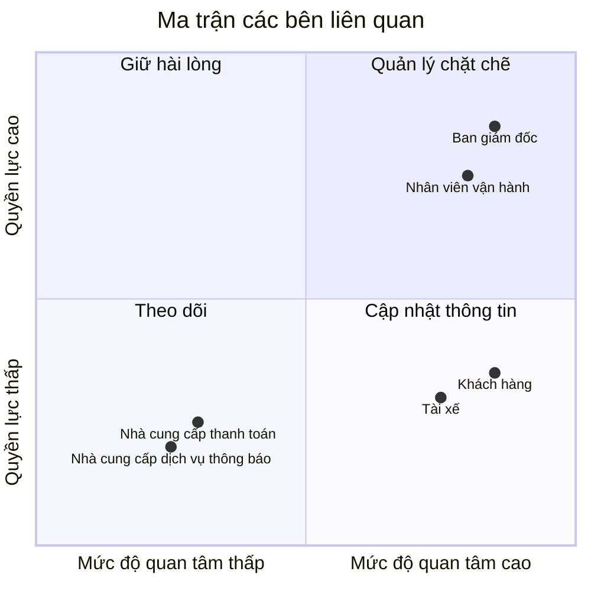
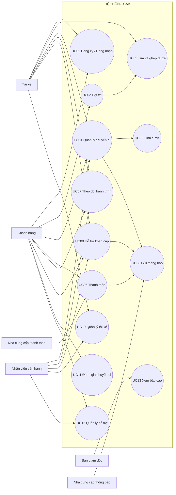
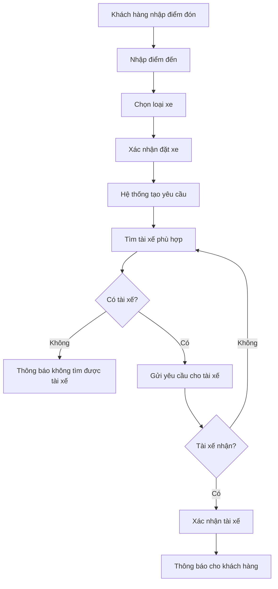
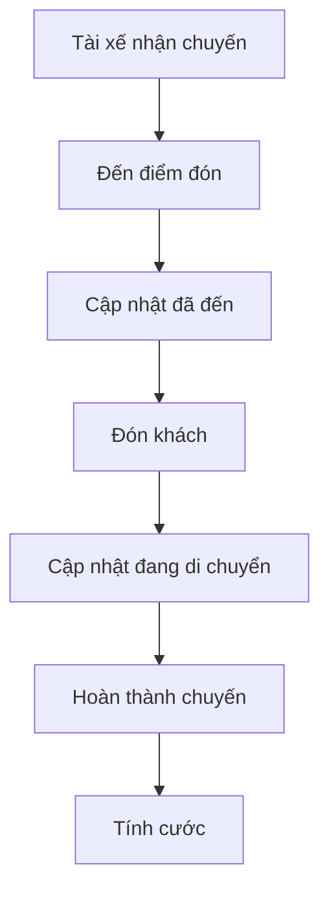
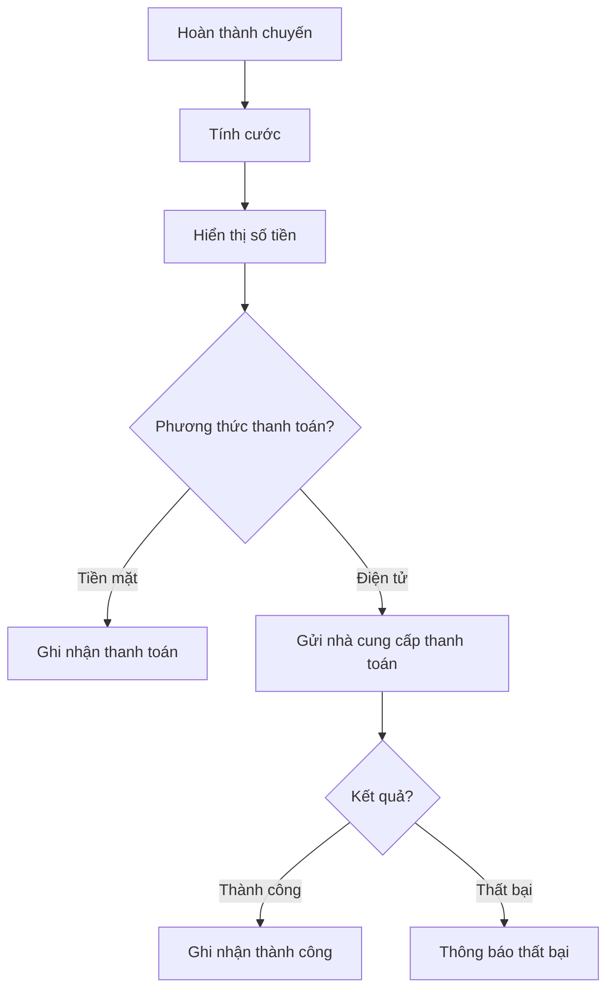
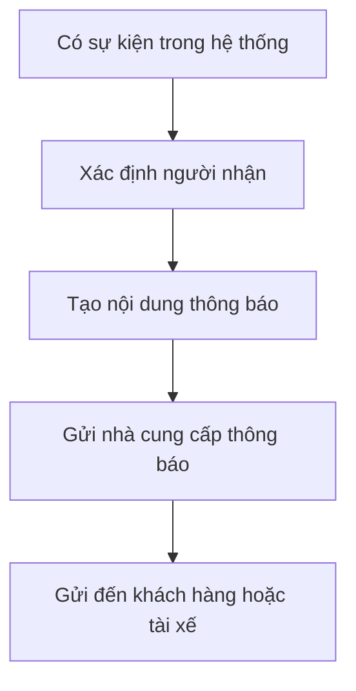
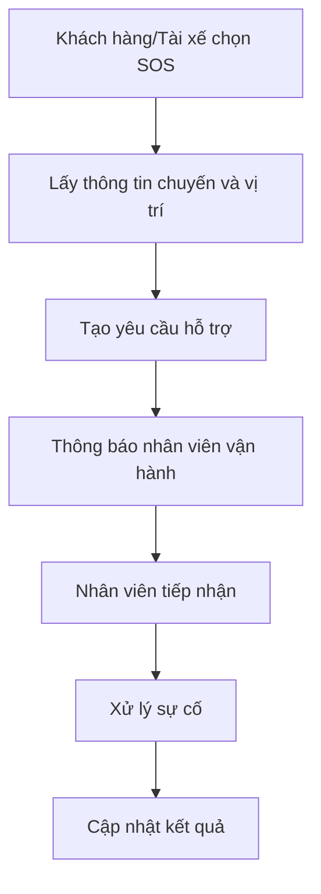
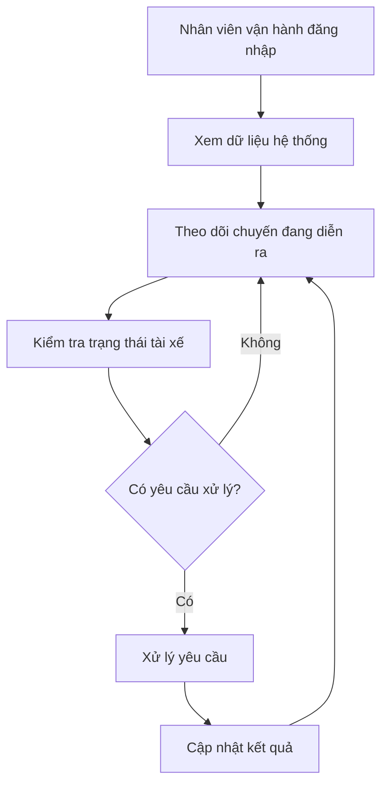

# PHÂN TÍCH HỆ THỐNG CAB

## Câu 1: Tìm hiểu nghiệp vụ

### a) Hệ thống hiện tại có những vấn đề gì?

- Việc tìm và phân công tài xế còn mất nhiều thời gian.
- Khách hàng khó theo dõi trạng thái chuyến đi.
- Thông tin thanh toán chưa được quản lý tập trung.
- Nhân viên vận hành khó quản lý khi số lượng chuyến tăng.
- Khi tài xế từ chối hoặc không phản hồi, việc tìm tài xế khác chưa được tự động hóa tốt.
- Khó theo dõi vị trí tài xế để tìm tài xế gần khách hàng.
- Hệ thống khó mở rộng thêm dịch vụ, phương thức thanh toán và kênh thông báo.

### b) Mục tiêu chính của hệ thống

- Cho phép khách hàng đặt xe dễ dàng.
- Tự động tìm và ghép tài xế phù hợp.
- Cho phép tài xế nhận và cập nhật chuyến.
- Cho khách hàng theo dõi trạng thái và vị trí chuyến đi.
- Tính cước và hỗ trợ thanh toán tiền mặt hoặc điện tử.
- Gửi thông báo khi có thay đổi quan trọng.
- Hỗ trợ nhân viên vận hành theo dõi và xử lý chuyến.
- Hỗ trợ đánh giá tài xế sau chuyến đi.
- Cung cấp báo cáo về hoạt động của hệ thống.
- Có khả năng mở rộng trong tương lai.

### c) Vấn đề nghiệp vụ cần giải quyết

- Tự động hóa việc tìm và ghép tài xế.
- Minh bạch trạng thái chuyến đi.
- Quản lý tập trung khách hàng, tài xế, phương tiện và chuyến đi.
- Quản lý thanh toán và giao dịch.
- Theo dõi vị trí tài xế.
- Hỗ trợ xử lý sự cố và thông báo kịp thời.

### d) Ai là người tham gia và sử dụng hệ thống?

#### d.1. Khách hàng (Customer)

- Đăng ký và đăng nhập.
- Cập nhật thông tin cá nhân.
- Nhập điểm đón, điểm đến và chọn loại xe.
- Đặt xe.
- Theo dõi chuyến đi.
- Xem thông tin tài xế và thời gian dự kiến đến.
- Xem lịch sử chuyến đi.
- Xem số tiền cần thanh toán và thanh toán.
- Đánh giá tài xế sau chuyến đi.
- Gửi yêu cầu hỗ trợ hoặc SOS khi cần.

#### d.2. Tài xế (Driver)

- Đăng ký tài khoản hoặc được nhân viên tạo tài khoản.
- Cập nhật thông tin cá nhân và phương tiện.
- Chuyển sang trạng thái sẵn sàng nhận chuyến.
- Nhận thông báo khi có chuyến mới.
- Chấp nhận hoặc từ chối chuyến.
- Cập nhật trạng thái chuyến.
- Cung cấp vị trí để hệ thống tìm tài xế phù hợp.
- Sử dụng chức năng hỗ trợ khẩn cấp khi cần.

#### d.3. Nhân viên vận hành (Operation Staff)

- Quản lý khách hàng.
- Quản lý tài xế và phương tiện.
- Quản lý các chuyến đi.
- Theo dõi các chuyến đang diễn ra.
- Kiểm tra trạng thái tài xế.
- Hỗ trợ xử lý chuyến bị lỗi.
- Tra cứu lịch sử giao dịch.
- Theo dõi hoạt động của hệ thống.

#### d.4. Ban giám đốc (Management)

- Theo dõi số lượng chuyến.
- Theo dõi doanh thu.
- Theo dõi tỷ lệ hoàn thành và tỷ lệ hủy.
- Theo dõi hiệu quả hoạt động của tài xế.
- Đưa ra định hướng phát triển hệ thống.

#### d.5. Nhà cung cấp thanh toán (Payment Provider)

- Xử lý giao dịch thanh toán điện tử.
- Trả kết quả giao dịch về hệ thống CAB.
- Hỗ trợ kết quả thanh toán thành công hoặc thất bại.
- CAB không lưu trực tiếp thông tin nhạy cảm của thẻ hoặc tài khoản thanh toán.

#### d.6. Nhà cung cấp dịch vụ thông báo (Notification Provider)

- Gửi thông báo khi khách hàng tạo yêu cầu đặt xe.
- Thông báo khi tài xế nhận chuyến.
- Thông báo khi tài xế đến điểm đón.
- Thông báo khi chuyến hoàn thành.
- Thông báo kết quả thanh toán.
- Thông báo các thay đổi của chuyến đi.

---

## Câu 2: Các bên liên quan

| Tên | Vai trò |
|---|---|
| **Khách hàng** | Đặt xe, theo dõi chuyến, thanh toán và đánh giá tài xế. |
| **Tài xế** | Nhận chuyến, thực hiện chuyến, cập nhật trạng thái và vị trí. |
| **Nhân viên vận hành** | Quản lý tài xế, phương tiện, chuyến đi và xử lý sự cố. |
| **Ban giám đốc** | Theo dõi báo cáo và hoạt động của hệ thống. |
| **Nhà cung cấp thanh toán** | Xử lý thanh toán điện tử. |
| **Nhà cung cấp dịch vụ thông báo** | Gửi thông báo cho khách hàng và tài xế. |

---

## Câu 3: Ma trận các bên liên quan

| Tên | Quyền lực | Mức độ quan tâm | Nhóm |
|---|---|---|---|
| **Ban giám đốc** | Cao | Cao | Quản lý chặt chẽ |
| **Nhân viên vận hành** | Cao | Cao | Quản lý chặt chẽ |
| **Khách hàng** | Thấp | Cao | Cập nhật thông tin |
| **Tài xế** | Thấp | Cao | Cập nhật thông tin |
| **Nhà cung cấp thanh toán** | Thấp | Thấp | Theo dõi |
| **Nhà cung cấp dịch vụ thông báo** | Thấp | Thấp | Theo dõi |

### Ma trận Quyền lực - Mức độ quan tâm

---

# Bước 4: Kế hoạch thực hiện trong 7 tuần

| Tuần | Nội dung thực hiện | Kết quả cần đạt |
|:---:|---|---|
| **Tuần 1** | Phân tích yêu cầu, xác định phạm vi, thiết kế cơ sở dữ liệu và kiến trúc hệ thống. | Hoàn thiện yêu cầu và thiết kế tổng thể. |
| **Tuần 2** | Xây dựng chức năng tài khoản và thông tin người dùng. | Người dùng có thể đăng ký, đăng nhập và quản lý thông tin. |
| **Tuần 3** | Xây dựng quản lý tài xế và phương tiện. | Quản lý được hồ sơ, phương tiện và trạng thái tài xế. |
| **Tuần 4** | Xây dựng đặt xe, tìm tài xế và quản lý chuyến đi. | Hoàn thành quy trình đặt và thực hiện chuyến. |
| **Tuần 5** | Xây dựng theo dõi hành trình, định vị và thông báo. | Theo dõi được vị trí và nhận thông báo. |
| **Tuần 6** | Xây dựng tính cước, thanh toán, đánh giá và hỗ trợ. | Hoàn thành các chức năng sau chuyến. |
| **Tuần 7** | Tích hợp, kiểm thử, sửa lỗi và hoàn thiện. | Hệ thống hoạt động theo quy trình đặt xe cơ bản. |

---

# Bước 5: Yêu Cầu Nghiệp Vụ (Business Requirements - BRD)

## 5.1. Nhóm Đặt Xe & Ghép Chuyến

| Mã BR | Tên yêu cầu | Mô tả ngắn |
|---|---|---|
| **BR-BOOK-01** | Tạo yêu cầu đặt xe | Khách hàng chọn điểm đón, điểm đến, loại xe và xác nhận đặt xe. |
| **BR-BOOK-02** | Tự động ghép tài xế | Hệ thống tìm tài xế phù hợp và gửi yêu cầu nhận chuyến. |
| **BR-BOOK-03** | Quản lý vòng đời chuyến | Quản lý trạng thái từ đặt chuyến đến hoàn thành hoặc hủy. |

## 5.2. Nhóm Giá Cước & Thanh Toán

| Mã BR | Tên yêu cầu | Mô tả ngắn |
|---|---|---|
| **BR-FIN-01** | Tính cước phí | Tính tiền dựa trên thông tin chuyến và bảng giá. |
| **BR-FIN-02** | Thanh toán | Hỗ trợ tiền mặt và thanh toán điện tử. |
| **BR-FIN-03** | Quản lý giao dịch | Lưu kết quả thanh toán và hỗ trợ xử lý giao dịch thất bại. |

## 5.3. Nhóm Theo Dõi & An Toàn

| Mã BR | Tên yêu cầu | Mô tả ngắn |
|---|---|---|
| **BR-TRK-01** | Theo dõi vị trí | Theo dõi vị trí tài xế và hành trình chuyến đi. |
| **BR-TRK-02** | Hỗ trợ khẩn cấp | Cho phép gửi yêu cầu SOS và thông tin vị trí khi cần. |

## 5.4. Nhóm Vận Hành & Chất Lượng

| Mã BR | Tên yêu cầu | Mô tả ngắn |
|---|---|---|
| **BR-OPS-01** | Quản lý tài xế | Quản lý hồ sơ, phương tiện và trạng thái tài xế. |
| **BR-OPS-02** | Đánh giá & phản hồi | Khách hàng đánh giá tài xế sau chuyến và gửi phản hồi. |
| **BR-OPS-03** | Quản lý hỗ trợ | Tiếp nhận và xử lý các yêu cầu hỗ trợ, chuyến bị lỗi. |
| **BR-OPS-04** | Báo cáo | Cung cấp số liệu về chuyến, doanh thu và hiệu quả tài xế. |

## 5.5. Nhóm Thông Báo

| Mã BR | Tên yêu cầu | Mô tả ngắn |
|---|---|---|
| **BR-NOTI-01** | Gửi thông báo | Gửi thông báo về đặt xe, nhận chuyến, trạng thái chuyến và thanh toán. |

---

# Bước 6: Phân Rã Chi Tiết Yêu Cầu Chức Năng (Feature Matrix)

| STT | Chức năng | Mô tả ngắn | Actor chính/phụ |
|:---:|---|---|---|
| **1** | **Đăng ký / Đăng nhập** | Tạo tài khoản, đăng nhập và xác thực người dùng. | Khách hàng, Tài xế |
| **2** | **Đặt xe** | Nhập điểm đón, điểm đến, chọn loại xe và tạo yêu cầu. | Khách hàng |
| **4** | **Tìm và ghép tài xế** | Tìm tài xế phù hợp và gửi yêu cầu nhận chuyến. | Hệ thống, Tài xế |
| **3** | **Quản lý chuyến đi** | Nhận chuyến, cập nhật trạng thái, hoàn thành hoặc hủy chuyến. | Tài xế, Khách hàng, NV vận hành |
| **5** | **Tính cước** | Tính số tiền khách hàng cần thanh toán. | Hệ thống |
| **6** | **Thanh toán** | Thanh toán tiền mặt hoặc thanh toán điện tử. | Khách hàng, Nhà cung cấp thanh toán |
| **7** | **Theo dõi hành trình** | Hiển thị trạng thái và vị trí tài xế trong chuyến đi. | Khách hàng, Tài xế, NV vận hành |
| **8** | **Gửi thông báo** | Gửi thông báo về các sự kiện quan trọng của chuyến và thanh toán. | Hệ thống, Nhà cung cấp thông báo |
| **9** | **Hỗ trợ khẩn cấp** | Gửi yêu cầu SOS và thông tin vị trí khi có sự cố. | Khách hàng, Tài xế, NV vận hành |
| **10** | **Quản lý tài xế** | Quản lý hồ sơ, phương tiện và trạng thái tài xế. | NV vận hành, Tài xế |
| **11** | **Đánh giá chuyến đi** | Khách hàng chấm điểm và gửi phản hồi sau chuyến. | Khách hàng |
| **12** | **Quản lý hỗ trợ** | Tiếp nhận và xử lý chuyến lỗi, yêu cầu hỗ trợ và giao dịch cần kiểm tra. | NV vận hành |
| **13** | **Xem báo cáo** | Theo dõi số lượng chuyến, doanh thu, tỷ lệ hoàn thành/hủy và hiệu quả tài xế. | Ban giám đốc |

---

# Bước 7: Vẽ Use Case Diagram

## 7.1. Các tác nhân

| Tác nhân | Vai trò |
|---|---|
| **Khách hàng** | Đặt xe, theo dõi chuyến, thanh toán, đánh giá và hỗ trợ khẩn cấp. |
| **Tài xế** | Nhận chuyến, thực hiện chuyến, cập nhật trạng thái và thông tin tài xế. |
| **Nhân viên vận hành** | Quản lý tài xế, chuyến đi, hỗ trợ và theo dõi hoạt động. |
| **Ban giám đốc** | Xem báo cáo hoạt động của hệ thống. |
| **Nhà cung cấp thanh toán** | Xử lý thanh toán điện tử. |
| **Nhà cung cấp dịch vụ thông báo** | Gửi thông báo cho khách hàng và tài xế. |

## 7.2. Use Case Diagram

# Bước 8: Đặc tả Use Case

## 8.1. UC01 - Đăng ký / Đăng nhập

| Thành phần | Nội dung |
|---|---|
| **Tác nhân chính** | Khách hàng hoặc Tài xế |
| **Tác nhân phụ** | Hệ thống |
| **Mục đích** | Tạo tài khoản và xác thực người dùng. |
| **Tiền điều kiện** | Người dùng chưa đăng nhập. |
| **Hậu điều kiện** | Tài khoản được tạo hoặc người dùng đăng nhập thành công. |

### Luồng chính

1. Người dùng chọn đăng ký hoặc đăng nhập.
2. Hệ thống hiển thị giao diện tương ứng.
3. Người dùng nhập thông tin tài khoản.
4. Hệ thống kiểm tra thông tin.
5. Hệ thống tạo tài khoản hoặc xác thực đăng nhập.
6. Hệ thống thông báo kết quả và cho phép người dùng sử dụng chức năng phù hợp.

### Luồng thay thế / ngoại lệ

- **4.1 Thông tin đăng ký không hợp lệ:** Hệ thống thông báo lỗi và yêu cầu nhập lại.
- **4.2 Tài khoản đã tồn tại:** Hệ thống thông báo và yêu cầu sử dụng thông tin khác.
- **5.1 Thông tin đăng nhập không đúng:** Hệ thống thông báo lỗi và yêu cầu đăng nhập lại.

---

## 8.2. UC02 - Đặt xe

| Thành phần | Nội dung |
|---|---|
| **Tác nhân chính** | Khách hàng |
| **Tác nhân phụ** | Hệ thống |
| **Mục đích** | Tạo yêu cầu đặt xe. |
| **Tiền điều kiện** | Khách hàng đã đăng nhập. |
| **Hậu điều kiện** | Yêu cầu đặt xe được tạo và chuyển sang tìm tài xế. |

### Luồng chính

| Người dùng | Hệ thống |
|---|---|
| 1. Khách hàng nhập điểm đón. | 2. Hệ thống tiếp nhận điểm đón. |
| 3. Khách hàng nhập điểm đến. | 4. Hệ thống tiếp nhận điểm đến. |
| 5. Khách hàng chọn loại xe. | 6. Hệ thống kiểm tra thông tin đặt xe. |
| 7. Khách hàng xác nhận đặt xe. | 8. Hệ thống tạo yêu cầu đặt xe. |
|  | 9. Hệ thống chuyển sang UC03 - Tìm và ghép tài xế. |

### Luồng thay thế / ngoại lệ

- **6.1 Thông tin đặt xe không hợp lệ:** Hệ thống thông báo lỗi và yêu cầu khách hàng nhập lại.
- **6.2 Khách hàng đang có chuyến chưa hoàn thành:** Hệ thống không cho tạo chuyến mới và thông báo cho khách hàng.

---

## 8.3. UC03 - Tìm và ghép tài xế

| Thành phần | Nội dung |
|---|---|
| **Tác nhân chính** | Hệ thống |
| **Tác nhân phụ** | Tài xế, Nhà cung cấp dịch vụ thông báo |
| **Mục đích** | Tìm tài xế phù hợp cho yêu cầu đặt xe. |
| **Tiền điều kiện** | Đã có yêu cầu đặt xe. |
| **Hậu điều kiện** | Tài xế được ghép hoặc khách hàng được thông báo không tìm thấy tài xế. |

### Luồng chính

1. Hệ thống lấy thông tin điểm đón và loại xe.
2. Hệ thống tìm các tài xế đang sẵn sàng.
3. Hệ thống kiểm tra tài xế phù hợp.
4. Hệ thống gửi yêu cầu nhận chuyến cho tài xế phù hợp.
5. Tài xế phản hồi nhận chuyến.
6. Hệ thống xác nhận tài xế cho chuyến.
7. Hệ thống gửi thông báo cho khách hàng.

### Luồng thay thế / ngoại lệ

- **5.1 Tài xế từ chối:** Hệ thống tìm tài xế khác.
- **5.2 Tài xế không phản hồi:** Hệ thống tìm tài xế khác.
- **2.1 Không có tài xế phù hợp:** Hệ thống thông báo cho khách hàng.

---

## 8.4. UC04 - Quản lý chuyến đi

| Thành phần | Nội dung |
|---|---|
| **Tác nhân chính** | Tài xế |
| **Tác nhân phụ** | Khách hàng, Nhân viên vận hành |
| **Mục đích** | Thực hiện và cập nhật trạng thái chuyến. |
| **Tiền điều kiện** | Chuyến đã được ghép với tài xế. |
| **Hậu điều kiện** | Chuyến hoàn thành hoặc được hủy; trạng thái được lưu. |

### Luồng chính

1. Tài xế nhận chuyến.
2. Tài xế di chuyển đến điểm đón.
3. Tài xế cập nhật đã đến điểm đón.
4. Tài xế đón khách.
5. Tài xế cập nhật trạng thái đang di chuyển.
6. Tài xế hoàn thành chuyến.
7. Hệ thống cập nhật trạng thái hoàn thành.
8. Hệ thống chuyển sang tính cước.

### Luồng thay thế / ngoại lệ

- **2.1 Khách hàng hủy chuyến:** Hệ thống cập nhật chuyến thành hủy.
- **5.1 Chuyến gặp lỗi:** Hệ thống chuyển yêu cầu sang UC12 - Quản lý hỗ trợ.

---

## 8.5. UC05 - Tính cước

| Thành phần | Nội dung |
|---|---|
| **Tác nhân chính** | Hệ thống |
| **Mục đích** | Tính số tiền cần thanh toán cho chuyến đi. |
| **Tiền điều kiện** | Chuyến đã hoàn thành. |
| **Hậu điều kiện** | Số tiền được lưu vào thông tin chuyến. |

### Luồng chính

1. Hệ thống lấy thông tin chuyến đi.
2. Hệ thống lấy bảng giá áp dụng.
3. Hệ thống tính cước.
4. Hệ thống lưu số tiền cần thanh toán.
5. Hệ thống hiển thị số tiền cho khách hàng.

### Ngoại lệ

- **2.1 Không có bảng giá phù hợp:** Hệ thống thông báo lỗi và chuyển cho nhân viên vận hành xử lý.

---

## 8.6. UC06 - Thanh toán

| Thành phần | Nội dung |
|---|---|
| **Tác nhân chính** | Khách hàng |
| **Tác nhân phụ** | Nhà cung cấp thanh toán |
| **Mục đích** | Thanh toán chi phí chuyến đi. |
| **Tiền điều kiện** | Chuyến đã hoàn thành và có số tiền cần thanh toán. |
| **Hậu điều kiện** | Giao dịch được ghi nhận thành công hoặc thất bại. |

### Luồng chính

1. Khách hàng xem số tiền cần thanh toán.
2. Khách hàng chọn phương thức thanh toán.
3. Hệ thống kiểm tra phương thức thanh toán.
4. Hệ thống ghi nhận thanh toán tiền mặt hoặc gửi giao dịch điện tử.
5. Nhà cung cấp thanh toán xử lý giao dịch điện tử.
6. Hệ thống nhận kết quả giao dịch.
7. Hệ thống cập nhật trạng thái thanh toán.
8. Hệ thống gửi thông báo kết quả.

### Ngoại lệ

- **5.1 Thanh toán điện tử thất bại:** Hệ thống thông báo cho khách hàng và cho phép xử lý lại theo chính sách.

---

## 8.7. UC07 - Theo dõi hành trình

| Thành phần | Nội dung |
|---|---|
| **Tác nhân chính** | Khách hàng |
| **Tác nhân phụ** | Tài xế, Nhân viên vận hành |
| **Mục đích** | Theo dõi trạng thái và vị trí của chuyến đi. |
| **Tiền điều kiện** | Khách hàng có chuyến đang diễn ra. |
| **Hậu điều kiện** | Thông tin chuyến và vị trí được hiển thị. |

### Luồng chính

1. Khách hàng mở thông tin chuyến.
2. Hệ thống hiển thị trạng thái chuyến.
3. Hệ thống hiển thị thông tin tài xế.
4. Hệ thống cập nhật vị trí tài xế.
5. Hệ thống hiển thị vị trí và thời gian dự kiến đến.

### Ngoại lệ

- **4.1 Không nhận được vị trí tài xế:** Hệ thống thông báo chưa thể cập nhật vị trí.

---

## 8.8. UC08 - Gửi thông báo

| Thành phần | Nội dung |
|---|---|
| **Tác nhân chính** | Hệ thống |
| **Tác nhân phụ** | Nhà cung cấp dịch vụ thông báo |
| **Mục đích** | Gửi thông báo khi có sự kiện quan trọng. |
| **Tiền điều kiện** | Có sự kiện cần thông báo. |
| **Hậu điều kiện** | Thông báo được gửi đến người nhận. |

### Luồng chính

1. Hệ thống phát sinh sự kiện cần thông báo.
2. Hệ thống xác định người nhận.
3. Hệ thống tạo nội dung thông báo.
4. Hệ thống gửi thông báo qua nhà cung cấp.
5. Nhà cung cấp dịch vụ thông báo thực hiện gửi.
6. Hệ thống ghi nhận kết quả gửi.

### Ngoại lệ

- **5.1 Gửi thông báo thất bại:** Hệ thống ghi nhận lỗi và thực hiện gửi lại theo chính sách.

---

## 8.9. UC09 - Hỗ trợ khẩn cấp

| Thành phần | Nội dung |
|---|---|
| **Tác nhân chính** | Khách hàng hoặc Tài xế |
| **Tác nhân phụ** | Nhân viên vận hành, Nhà cung cấp dịch vụ thông báo |
| **Mục đích** | Gửi yêu cầu hỗ trợ khẩn cấp khi có sự cố. |
| **Tiền điều kiện** | Khách hàng hoặc tài xế đang có chuyến. |
| **Hậu điều kiện** | Yêu cầu SOS được gửi và nhân viên vận hành được thông báo. |

### Luồng chính

1. Khách hàng hoặc tài xế chọn chức năng SOS.
2. Hệ thống lấy thông tin chuyến và vị trí hiện tại.
3. Hệ thống tạo yêu cầu hỗ trợ khẩn cấp.
4. Hệ thống gửi thông báo cho nhân viên vận hành.
5. Nhân viên vận hành tiếp nhận yêu cầu.
6. Hệ thống cập nhật trạng thái xử lý.

### Ngoại lệ

- **2.1 Không lấy được vị trí:** Hệ thống vẫn tạo yêu cầu và thông báo vị trí chưa xác định.

---

## 8.10. UC10 - Quản lý tài xế

| Thành phần | Nội dung |
|---|---|
| **Tác nhân chính** | Nhân viên vận hành |
| **Tác nhân phụ** | Tài xế |
| **Mục đích** | Quản lý thông tin, phương tiện và trạng thái tài xế. |
| **Tiền điều kiện** | Nhân viên vận hành đã đăng nhập và có quyền. |
| **Hậu điều kiện** | Thông tin tài xế được thêm, cập nhật hoặc quản lý. |

### Luồng chính

1. Nhân viên vận hành mở chức năng quản lý tài xế.
2. Hệ thống hiển thị danh sách tài xế.
3. Nhân viên vận hành chọn tài xế cần xử lý.
4. Nhân viên vận hành xem hoặc cập nhật thông tin.
5. Hệ thống kiểm tra thông tin.
6. Hệ thống lưu thay đổi.

### Ngoại lệ

- **5.1 Thông tin không hợp lệ:** Hệ thống thông báo lỗi và yêu cầu cập nhật lại.

---

## 8.11. UC11 - Đánh giá chuyến đi

| Thành phần | Nội dung |
|---|---|
| **Tác nhân chính** | Khách hàng |
| **Mục đích** | Đánh giá tài xế sau chuyến đi. |
| **Tiền điều kiện** | Chuyến đã hoàn thành. |
| **Hậu điều kiện** | Đánh giá được lưu vào hệ thống. |

### Luồng chính

1. Khách hàng mở chuyến đã hoàn thành.
2. Hệ thống hiển thị chức năng đánh giá.
3. Khách hàng chọn mức đánh giá và nhập phản hồi.
4. Khách hàng gửi đánh giá.
5. Hệ thống kiểm tra thông tin đánh giá.
6. Hệ thống lưu đánh giá.
7. Hệ thống cập nhật thông tin đánh giá của tài xế.

### Ngoại lệ

- **5.1 Đánh giá không hợp lệ:** Hệ thống thông báo lỗi và yêu cầu nhập lại.

---

## 8.12. UC12 - Quản lý hỗ trợ

| Thành phần | Nội dung |
|---|---|
| **Tác nhân chính** | Nhân viên vận hành |
| **Tác nhân phụ** | Khách hàng, Tài xế |
| **Mục đích** | Tiếp nhận và xử lý các yêu cầu hỗ trợ hoặc chuyến bị lỗi. |
| **Tiền điều kiện** | Có yêu cầu hỗ trợ hoặc chuyến cần xử lý. |
| **Hậu điều kiện** | Yêu cầu được xử lý và cập nhật kết quả. |

### Luồng chính

1. Nhân viên vận hành mở danh sách yêu cầu hỗ trợ.
2. Hệ thống hiển thị các yêu cầu cần xử lý.
3. Nhân viên vận hành chọn yêu cầu.
4. Hệ thống hiển thị thông tin liên quan.
5. Nhân viên vận hành kiểm tra và xử lý.
6. Nhân viên vận hành cập nhật kết quả.
7. Hệ thống lưu kết quả xử lý.
8. Hệ thống thông báo kết quả cho người liên quan.

### Ngoại lệ

- **4.1 Thiếu thông tin xử lý:** Hệ thống yêu cầu bổ sung thông tin trước khi hoàn tất.

---

## 8.13. UC13 - Xem báo cáo

| Thành phần | Nội dung |
|---|---|
| **Tác nhân chính** | Ban giám đốc |
| **Mục đích** | Theo dõi tình hình hoạt động của hệ thống. |
| **Tiền điều kiện** | Ban giám đốc đã đăng nhập và có quyền xem báo cáo. |
| **Hậu điều kiện** | Báo cáo được hiển thị. |

### Luồng chính

1. Ban giám đốc mở chức năng báo cáo.
2. Hệ thống lấy dữ liệu hoạt động.
3. Hệ thống tổng hợp số lượng chuyến.
4. Hệ thống tổng hợp doanh thu.
5. Hệ thống tổng hợp tỷ lệ hoàn thành và tỷ lệ hủy.
6. Hệ thống tổng hợp hiệu quả hoạt động của tài xế.
7. Hệ thống hiển thị báo cáo.

### Ngoại lệ

- **2.1 Không có dữ liệu:** Hệ thống thông báo chưa có dữ liệu để hiển thị.

---

# Bước 9: Phân tích quy trình nghiệp vụ

## 9.1. Quy trình đặt xe và ghép tài xế

## 9.2. Quy trình thực hiện chuyến

## 9.3. Quy trình thanh toán

## 9.4. Quy trình thông báo

## 9.5. Quy trình hỗ trợ khẩn cấp

## 9.6. Quy trình vận hành

## 9.7. Phân tích Input - Process - Output

| Quy trình | Đầu vào | Xử lý | Đầu ra |
|---|---|---|---|
| **Đặt xe** | Điểm đón, điểm đến, loại xe | Kiểm tra và tạo yêu cầu | Yêu cầu đặt xe |
| **Tìm và ghép tài xế** | Vị trí, loại xe, tài xế sẵn sàng | Tìm và gửi yêu cầu | Tài xế được ghép |
| **Quản lý chuyến** | Chuyến đã ghép | Cập nhật trạng thái | Chuyến hoàn thành/hủy |
| **Tính cước** | Thông tin chuyến, bảng giá | Tính tiền | Số tiền cần thanh toán |
| **Thanh toán** | Số tiền, phương thức | Xử lý giao dịch | Kết quả thanh toán |
| **Theo dõi hành trình** | Vị trí, trạng thái chuyến | Cập nhật và hiển thị | Thông tin hành trình |
| **Gửi thông báo** | Sự kiện hệ thống | Tạo và gửi thông báo | Thông báo |
| **Hỗ trợ khẩn cấp** | Yêu cầu SOS, vị trí | Tạo và xử lý yêu cầu | Kết quả hỗ trợ |
| **Quản lý tài xế** | Thông tin tài xế | Thêm, sửa, quản lý | Hồ sơ tài xế |
| **Đánh giá** | Đánh giá, phản hồi | Kiểm tra và lưu | Kết quả đánh giá |
| **Quản lý hỗ trợ** | Yêu cầu hỗ trợ | Kiểm tra và xử lý | Kết quả xử lý |
| **Xem báo cáo** | Dữ liệu hệ thống | Tổng hợp và thống kê | Báo cáo |

---

# Bước 10: Phân tích các quy tắc nghiệp vụ

## 10.1. Quy tắc về đăng ký và đăng nhập

| Mã | Quy tắc |
|---|---|
| **BRULE01** | Người dùng phải đăng nhập trước khi sử dụng các chức năng cần xác thực. |
| **BRULE02** | Thông tin đăng ký phải đầy đủ và đúng định dạng. |
| **BRULE03** | Mỗi tài khoản phải có thông tin đăng nhập riêng. |
| **BRULE04** | Người dùng chỉ được sử dụng chức năng phù hợp với vai trò. |

## 10.1. Quy tắc về người dùng

| Mã | Quy tắc |
|---|---|
| **BRULE01** | Người dùng phải đăng nhập trước khi sử dụng chức năng yêu cầu tài khoản. |
| **BRULE02** | Người dùng chỉ được sử dụng chức năng phù hợp với vai trò. |
| **BRULE03** | Các chức năng quản lý phải được kiểm soát quyền truy cập. |

## 10.2. Quy tắc về đặt xe

| Mã | Quy tắc |
|---|---|
| **BRULE04** | Khách hàng phải nhập điểm đón và điểm đến trước khi đặt xe. |
| **BRULE49** | Khách hàng phải chọn loại xe. |
| **BRULE50** | Khi tạo yêu cầu thành công, hệ thống phải tìm tài xế. |
| **BRULE47** | Khách hàng không được tạo chuyến mới khi đang có chuyến chưa hoàn thành. |

## 10.3. Quy tắc về tìm và ghép tài xế

| Mã | Quy tắc |
|---|---|
| **BRULE48** | Chỉ tài xế sẵn sàng mới được xem xét nhận chuyến. |
| **BRULE49** | Tài xế phải phù hợp với loại xe khách hàng chọn. |
| **BRULE50** | Hệ thống ưu tiên tài xế phù hợp và gần khách hàng. |
| **BRULE47** | Nếu tài xế từ chối, hệ thống tìm tài xế khác. |
| **BRULE48** | Nếu tài xế không phản hồi, hệ thống tìm tài xế khác. |
| **BRULE49** | Nếu không còn tài xế phù hợp, khách hàng phải được thông báo. |

## 10.4. Quy tắc về chuyến đi

| Mã | Quy tắc |
|---|---|
| **BRULE50** | Mỗi chuyến phải gắn với khách hàng và tài xế được phân công. |
| **BRULE47** | Tài xế phải cập nhật trạng thái trong quá trình thực hiện chuyến. |
| **BRULE48** | Trạng thái chuyến phải được lưu để khách hàng và vận hành theo dõi. |
| **BRULE49** | Khi chuyến hoàn thành, hệ thống chuyển sang bước tính cước. |
| **BRULE50** | Chuyến bị lỗi phải được nhân viên vận hành hỗ trợ xử lý. |

## 10.5. Quy tắc về vị trí và hành trình

| Mã | Quy tắc |
|---|---|
| **BRULE47** | Hệ thống sử dụng vị trí tài xế để hỗ trợ tìm tài xế phù hợp. |
| **BRULE48** | Vị trí tài xế được sử dụng để hỗ trợ theo dõi hành trình. |
| **BRULE49** | Dữ liệu vị trí phải được bảo vệ. |

## 10.6. Quy tắc về tính cước

| Mã | Quy tắc |
|---|---|
| **BRULE50** | Hệ thống tính cước sau khi chuyến hoàn thành. |
| **BRULE47** | Số tiền thanh toán được xác định dựa trên thông tin chuyến và bảng giá. |
| **BRULE48** | Thông tin cước phải được lưu cùng chuyến đi. |

## 10.7. Quy tắc về thanh toán

| Mã | Quy tắc |
|---|---|
| **BRULE49** | Hỗ trợ thanh toán tiền mặt và điện tử. |
| **BRULE50** | Thanh toán điện tử sử dụng nhà cung cấp bên ngoài. |
| **BRULE47** | CAB không lưu trực tiếp thông tin nhạy cảm của thẻ hoặc tài khoản thanh toán. |
| **BRULE48** | Hệ thống phải lưu kết quả giao dịch. |
| **BRULE49** | Khi thanh toán thất bại, khách hàng phải được thông báo. |

## 10.8. Quy tắc về thông báo

| Mã | Quy tắc |
|---|---|
| **BRULE50** | Thông báo khi yêu cầu đặt xe được tiếp nhận. |
| **BRULE47** | Thông báo khi tài xế nhận chuyến. |
| **BRULE48** | Thông báo khi tài xế đến điểm đón. |
| **BRULE49** | Thông báo khi chuyến hoàn thành. |
| **BRULE50** | Thông báo kết quả thanh toán. |
| **BRULE47** | Thông báo khi chuyến có thay đổi quan trọng. |

## 10.9. Quy tắc về hỗ trợ và an toàn

| Mã | Quy tắc |
|---|---|
| **BRULE48** | Khách hàng hoặc tài xế có thể gửi yêu cầu SOS khi đang có chuyến. |
| **BRULE49** | Yêu cầu SOS phải được chuyển đến nhân viên vận hành. |
| **BRULE50** | Yêu cầu hỗ trợ phải được lưu và cập nhật kết quả xử lý. |

## 10.10. Quy tắc về tài xế và đánh giá

| Mã | Quy tắc |
|---|---|
| **BRULE47** | Thông tin tài xế và phương tiện phải được quản lý tập trung. |
| **BRULE48** | Khách hàng chỉ được đánh giá sau khi chuyến hoàn thành. |
| **BRULE49** | Đánh giá phải gắn với chuyến đi và tài xế. |
| **BRULE50** | Đánh giá được lưu để theo dõi hiệu quả tài xế. |

## 10.11. Quy tắc về báo cáo

| Mã | Quy tắc |
|---|---|
| **BRULE47** | Ban giám đốc được xem báo cáo theo quyền được cấp. |
| **BRULE48** | Báo cáo phải có số lượng chuyến và doanh thu. |
| **BRULE49** | Báo cáo phải có tỷ lệ hoàn thành và tỷ lệ hủy. |
| **BRULE50** | Báo cáo phải có thông tin về hiệu quả hoạt động của tài xế. |

## 10.12. Các nội dung cần làm rõ

| STT | Nội dung |
|---|---|
| 1 | Công thức tính cước cụ thể. |
| 2 | Tiêu chí ưu tiên tài xế. |
| 3 | Thời gian tài xế phải phản hồi. |
| 4 | Số lần hệ thống tìm tài xế lại. |
| 5 | Chính sách hủy chuyến và phí hủy. |
| 6 | Cách xử lý khi mất kết nối mạng. |
| 7 | Thời gian lưu trữ dữ liệu. |
| 8 | Quyền chi tiết của từng loại nhân viên vận hành. |
