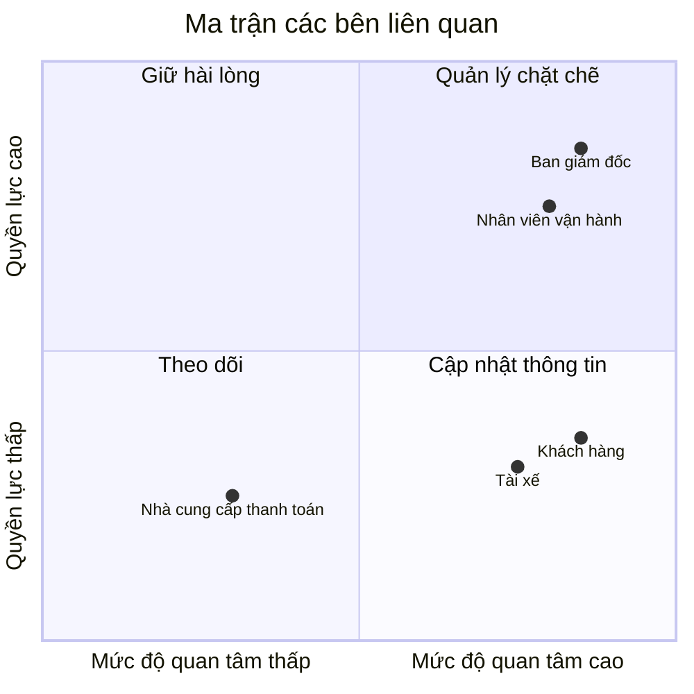
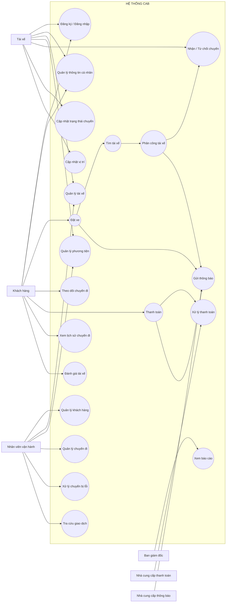
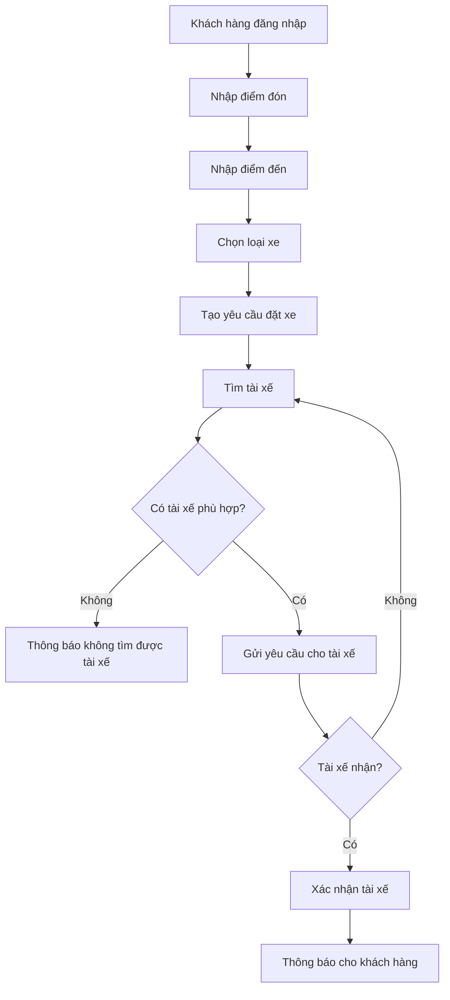
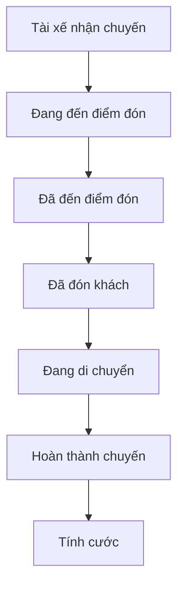
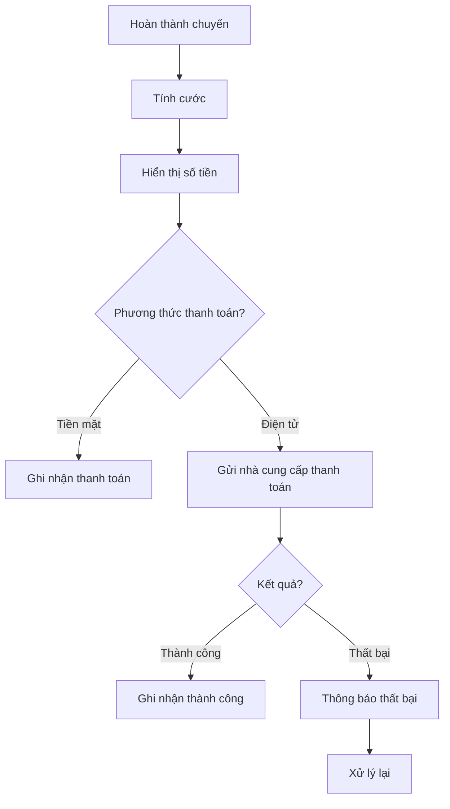
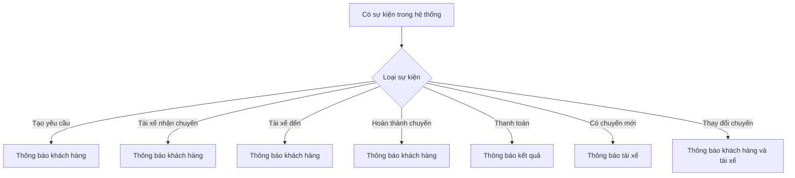
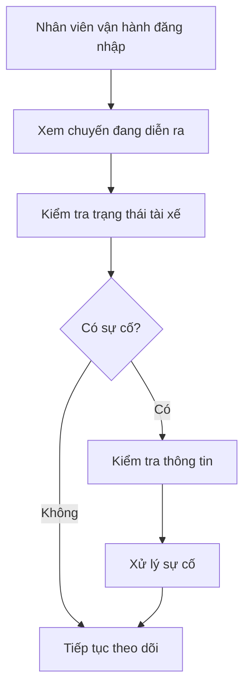

 ## Câu 1: Tìm hiểu nghiệp vụ
### a) Hệ thống hiện tại có những vấn đề gì?
- Việc phân công tài xế chủ yếu vẫn làm thủ công nên có thể mất nhiều thời gian.
- Khách hàng khó theo dõi được trạng thái chuyến đi của mình.
- Thông tin thanh toán chưa được quản lý tập trung.
- Bộ phận vận hành gặp khó khăn khi số lượng khách hàng và tài xế tăng lên.
- Khi tài xế đầu tiên không nhận chuyến thì việc tìm tài xế khác chưa được tự động hóa tốt.
- Khó theo dõi vị trí của tài xế để tìm tài xế gần khách hàng và dự đoán thời gian tài xế đến.
- Hệ thống hiện tại khó mở rộng thêm các chức năng mới trong tương lai.
### b) Mục tiêu chính của hệ thống
- Cho phép khách hàng đặt xe một cách dễ dàng.
- Tự động tìm và phân công tài xế phù hợp cho khách hàng.
- Cho khách hàng theo dõi được trạng thái chuyến đi.
- Cho phép tài xế nhận và cập nhật trạng thái chuyến.
- Hỗ trợ tính cước và thanh toán bằng tiền mặt hoặc thanh toán điện tử.
- Quản lý thông tin khách hàng, tài xế, phương tiện và chuyến đi tập trung.
- Gửi thông báo cho khách hàng và tài xế khi có các sự kiện quan trọng.
- Hỗ trợ nhân viên vận hành theo dõi và xử lý các chuyến đi.
- Có báo cáo về số lượng chuyến, doanh thu, tỷ lệ hoàn thành, tỷ lệ hủy và hiệu quả của tài xế.
- Hệ thống phải có khả năng mở rộng để sau này có thể thêm dịch vụ, phương thức thanh toán hoặc nhà cung cấp thông báo mới.
### c) Vấn đề hiện tại là gì?
- Việc tìm và phân công tài xế mất nhiều thời gian.
- Khách hàng không biết chính xác chuyến xe đang ở trạng thái nào.
- Nhân viên vận hành khó quản lý khi số lượng chuyến tăng.
- Việc thanh toán và thông tin giao dịch chưa được quản lý tốt.
- Hệ thống khó mở rộng khi công ty muốn phát triển thêm.
### d) Ai là người tham gia và sử dụng hệ thống?
#### d.1. Khách hàng (Customer)
- Đăng ký và đăng nhập.
- Cập nhật thông tin cá nhân.
- Nhập điểm đón và điểm đến.
- Chọn loại xe.
- Đặt xe.
- Theo dõi trạng thái chuyến đi.
- Xem thông tin tài xế và thời gian dự kiến tài xế đến.
- Xem lịch sử chuyến đi.
- Xem số tiền cần thanh toán.
- Thanh toán.
- Đánh giá tài xế sau chuyến đi.
#### d.2. Tài xế (Driver)
- Đăng ký tài khoản hoặc được nhân viên tạo tài khoản.
- Cập nhật thông tin cá nhân.
- Cập nhật thông tin phương tiện.
- Chuyển sang trạng thái sẵn sàng nhận chuyến.
- Nhận thông báo khi có chuyến mới.
- Chấp nhận hoặc từ chối chuyến.
- Cập nhật trạng thái chuyến:
  - Đã đến điểm đón.
  - Đã đón khách.
  - Đang di chuyển.
  - Hoàn thành chuyến.
- Hệ thống lưu vị trí của tài xế để hỗ trợ tìm tài xế gần khách hàng.
#### d.3. Nhân viên vận hành (Operation Staff)
- Quản lý khách hàng.
- Quản lý tài xế.
- Quản lý phương tiện.
- Quản lý các chuyến đi.
- Xem các chuyến đang diễn ra.
- Kiểm tra trạng thái của tài xế.
- Hỗ trợ xử lý các chuyến bị lỗi.
- Tra cứu lịch sử giao dịch.
- Theo dõi các báo cáo về hoạt động của hệ thống.
#### d.4. Ban giám đốc (Management)
- Theo dõi số lượng chuyến đi.
- Theo dõi doanh thu.
- Theo dõi tỷ lệ chuyến hoàn thành.
- Theo dõi tỷ lệ chuyến bị hủy.
- Theo dõi hiệu quả hoạt động của tài xế.
- Đưa ra các yêu cầu và định hướng phát triển hệ thống.
- Định hướng mở rộng thêm các loại dịch vụ, phương thức thanh toán và các kênh thông báo trong tương lai.
#### d.5. Nhà cung cấp thanh toán (Payment Provider)
- Xử lý các giao dịch thanh toán điện tử của khách hàng.
- Trả kết quả thanh toán về cho hệ thống CAB.
- Hỗ trợ trường hợp thanh toán thành công hoặc thất bại.
- Hệ thống CAB không lưu trực tiếp các thông tin nhạy cảm của thẻ hoặc tài khoản thanh toán.
- Khi thanh toán thất bại, hệ thống cần thông báo cho khách hàng và cho phép xử lý lại theo chính sách của công ty.
#### d.6. Nhà cung cấp dịch vụ thông báo (Notification Provider)
- Gửi thông báo khi khách hàng tạo yêu cầu đặt xe.
- Thông báo khi có tài xế nhận chuyến.
- Thông báo khi tài xế đến điểm đón.
- Thông báo khi chuyến đi hoàn thành.
- Thông báo kết quả thanh toán.
- Gửi các thông báo liên quan đến thay đổi của chuyến đi cho khách hàng và tài xế.
---
## Câu 2: Các bên liên quan
### Stakeholder
| Tên | Vai trò |
|---|---|
| **Khách hàng (Customer)** | Đăng ký, đặt xe, theo dõi chuyến đi, thanh toán, xem lịch sử và đánh giá tài xế. |
| **Tài xế (Driver)** | Nhận hoặc từ chối chuyến, cập nhật trạng thái chuyến, quản lý thông tin cá nhân và phương tiện, cung cấp vị trí để hệ thống tìm tài xế phù hợp. |
| **Nhân viên vận hành (Operation Staff)** | Quản lý khách hàng, tài xế, phương tiện và chuyến đi; theo dõi chuyến đang diễn ra, xử lý các trường hợp lỗi và tra cứu giao dịch. |
| **Ban giám đốc (Management)** | Theo dõi số lượng chuyến, doanh thu, tỷ lệ hoàn thành/hủy và hiệu quả tài xế; đưa ra định hướng phát triển hệ thống. |
| **Nhà cung cấp thanh toán (Payment Provider)** | Xử lý thanh toán điện tử và trả kết quả giao dịch về hệ thống CAB. |
| **Nhà cung cấp dịch vụ thông báo (Notification Provider)** | Gửi các thông báo liên quan đến đặt xe, tài xế, chuyến đi và thanh toán cho khách hàng và tài xế. |
---
## Câu 3: Ma trận các bên liên quan
### Bảng phân loại

| **Tên** | **Quyền lực** | **Mức độ quan tâm** | **Nhóm** |
|---|---|---|---|
| **Ban giám đốc** | Cao | Cao | Quản lý chặt chẽ |
| **Nhân viên vận hành** | Cao | Cao | Quản lý chặt chẽ |
| **Khách hàng** | Thấp | Cao | Cập nhật thông tin |
| **Tài xế** | Thấp | Cao | Cập nhật thông tin |
| **Nhà cung cấp thanh toán** | Thấp | Thấp | Theo dõi |
| **Nhà cung cấp dịch vụ thông báo** | Thấp | Thấp | Theo dõi |

### Ma trận Quyền lực - Mức độ quan tâm

  ## 4.Kế hoạch thực hiện trong 7 tuần
| Tuần | Nội dung thực hiện | Kết quả cần đạt |
|:---:|---|---|
| **Tuần 1** | Phân tích yêu cầu, xác định phạm vi, thiết kế cơ sở dữ liệu và kiến trúc hệ thống. | Hoàn thiện yêu cầu, sơ đồ nghiệp vụ, cơ sở dữ liệu và thiết kế tổng thể. |
| **Tuần 2** | Xây dựng **Module Xác thực** và **Module Quản lý người dùng**. | Người dùng có thể đăng ký, đăng nhập, đăng xuất và được phân quyền. |
| **Tuần 3** | Xây dựng **Module Quản lý tài xế** và **Module Quản lý phương tiện**. | Tài xế có hồ sơ, phương tiện và trạng thái sẵn sàng nhận chuyến. |
| **Tuần 4** | Xây dựng **Module Quản lý đặt xe** và **Module Quản lý chuyến đi**. | Khách hàng có thể đặt xe và tài xế có thể nhận, cập nhật chuyến. |
| **Tuần 5** | Xây dựng **Module Quản lý bản đồ và định vị**. | Hiển thị vị trí, điểm đón, điểm đến và theo dõi vị trí tài xế. |
| **Tuần 6** | Xây dựng **Module Quản lý thanh toán**, **Module Lịch sử & Đánh giá** và **Module Quản trị hệ thống**. | Hoàn thành các chức năng thanh toán, lịch sử, đánh giá và quản trị cơ bản. |
| **Tuần 7** | Tích hợp toàn bộ module, kiểm thử, sửa lỗi và hoàn thiện hệ thống. | Hệ thống hoạt động hoàn chỉnh theo quy trình đặt xe trực tuyến cơ bản. |

## 5. Yêu Cầu Nghiệp Vụ (Business Requirements - BRD)

---

### 5.1. Nhóm Yêu Cầu: Đặt Xe & Điều Phối Chuyến Đi (Booking & Matching)

| Mã BR | Tên Yêu Cầu Nghiệp Vụ | Mô Tả Nghiệp Vụ & Quy Tắc Kinh Doanh | Mục Tiêu Kinh Doanh / KPI |
| :--- | :--- | :--- | :--- |
| **BR-BOOK-01** | **Tạo yêu cầu đặt xe tức thì** | • Khách hàng chọn điểm đi, điểm đến và xem trước giá cước trị giá cố định trước khi xác nhận. • Hệ thống chỉ cho phép tạo chuyến nếu khách hàng không có chuyến đi nào đang dở dang. | Tối ưu trải nghiệm đặt xe, tỉ lệ hoàn tất thao tác đặt xe trong **< 15 giây**. |
| **BR-BOOK-02** | **Tự động ghép chuyến theo bán kính** | • Hệ thống tự động quét và gửi thông báo mời nhận chuyến cho tài xế rảnh gần nhất trong bán kính $R$ (mặc định 3km). • Nếu tài xế từ chối hoặc quá 15 giây không phản hồi, tự động chuyển sang tài xế tiếp theo. | Đạt tỉ lệ ghép chuyến thành công **> 85%** trong lần quét đầu tiên; thời gian chờ tài xế **< 30 giây**. |
| **BR-BOOK-03** | **Quản lý vòng đời chuyến đi** | • Chuyến đi trải qua các trạng thái bắt buộc: *Đã đặt $\rightarrow$ Tài xế nhận $\rightarrow$ Đã đến điểm đón $\rightarrow$ Đang di chuyển $\rightarrow$ Hoàn thành (hoặc Hủy)*. • Cho phép hủy chuyến miễn phí trong 2 phút đầu sau khi tài xế nhận chuyến. | Minh bạch luồng vận hành, giảm tỉ lệ tranh chấp hủy chuyến dưới **5%**. |

---

### 5.2. Nhóm Yêu Cầu: Giá Cước & Thanh Toán (Pricing & Settlement)

| Mã BR | Tên Yêu Cầu Nghiệp Vụ | Mô Tả Nghiệp Vụ & Quy Tắc Kinh Doanh | Mục Tiêu Kinh Doanh / KPI |
| :--- | :--- | :--- | :--- |
| **BR-FIN-01** | **Tính cước phí tự động** | • Công thức tính cước: `Tổng giá = Giá mở cửa + (Số km x Đơn giá/km) + Phí chờ` (nếu có). • Bảng giá có thể điều chỉnh linh hoạt theo khung giờ (Giờ cao điểm / Giờ đêm) bởi Khối Vận hành. | Đảm bảo tính cước chính xác 100%, không xảy ra sai lệch giữa ứng dụng và máy chủ. |
| **BR-FIN-02** | **Hỗ trợ đa dạng thanh toán** | • Hỗ trợ 2 hình thức: **Tiền mặt** và **Thanh toán điện tử** (Cổng VNPay/MoMo). • Với thanh toán điện tử, hệ thống giữ tiền (Hold/Pre-auth) hoặc thu tiền ngay khi hoàn thành chuyến đi. | Giảm tỷ lệ giao dịch thất bại xuống **< 1%**; đối soát dòng tiền chính xác trong ngày (T+0). |
| **BR-FIN-03** | **Tự động trích xuất hoa hồng tài xế** | • Hệ thống tự động khấu trừ % chiết khấu (ví dụ: 20%) trên mỗi chuyến đi hoàn thành vào Ví điện tử của Tài xế. • Tài xế phải duy trì số dư tối thiểu trong ví để tiếp tục nhận chuyến. | Tự động hóa đối soát tài chính, loại bỏ 100% công đoạn tính toán thủ công. |

---

### 5.3. Nhóm Yêu Cầu: Giám Sát Hành Trình & An Toàn (Tracking & Safety)

| Mã BR | Tên Yêu Cầu Nghiệp Vụ | Mô Tả Nghiệp Vụ & Quy Tắc Kinh Doanh | Mục Tiêu Kinh Doanh / KPI |
| :--- | :--- | :--- | :--- |
| **BR-TRK-01** | **Theo dõi vị trí thời gian thực** | • Khách hàng và Khối Vận hành theo dõi được vị trí di chuyển thực tế của tài xế trên bản đồ với độ trễ tối đa 3-5 giây. • Tự động tính toán lại thời gian dự kiến đến (ETA). | Tăng mức độ an tâm cho khách hàng; độ chính xác định vị sai số **< 10m**. |
| **BR-TRK-02** | **Cảnh báo và xử lý sự cố khẩn cấp** | • Cung cấp nút hỗ trợ khẩn cấp / báo sự cố trên ứng dụng cho cả Khách hàng và Tài xế. • Tự động bắn cảnh báo ưu tiên cao về màn hình giám sát của Khối Vận hành. | Thời gian phản hồi sự cố khẩn cấp của bộ phận Vận hành **< 3 phút**. |

---

### 5.4. Nhóm Yêu Cầu: Đánh Giá & Vận Hành Khách Hàng (Customer Experience & Ops)

| Mã BR | Tên Yêu Cầu Nghiệp Vụ | Mô Tả Nghiệp Vụ & Quy Tắc Kinh Doanh | Mục Tiêu Kinh Doanh / KPI |
| :--- | :--- | :--- | :--- |
| **BR-OPS-01** | **Duyệt hồ sơ & Quản lý đối tác tài xế** | • Tài xế chỉ được phép bật chế độ "Sẵn sàng nhận chuyến" sau khi bộ phận Vận hành thẩm định và duyệt đầy đủ: *Bằng lái, Căn cước, Đăng ký xe, Bảo hiểm*. • Tự động khóa tài khoản nếu tài xế bị đánh giá dưới 3.0★. | Đảm bảo 100% tài xế lưu thông trên hệ thống hợp pháp và đạt chuẩn chất lượng. |
| **BR-OPS-02** | **Đánh giá và Tiếp nhận phản hồi** | • Cho phép khách hàng chấm điểm (1-5 sao) và chọn lý do phản hồi sau khi kết thúc chuyến. • Tự động tạo ticket xử lý cho CS khi nhận đánh giá 1-2 sao hoặc có phản ánh thái độ/phụ phí. | Duy trì điểm hài lòng trung bình của dịch vụ (CSAT) **$\ge$ 4.5/5.0★**. |

---

## 6. Phân Rã Chi Tiết Yêu Cầu Chức Năng (Functional Requirements Breakdown)

---

##  Danh Sách Chức Năng Hệ Thống (Feature Matrix)

Bảng tổng hợp chi tiết toàn bộ các chức năng hệ thống được trích xuất từ các **Yêu Cầu Nghiệp Vụ (BRD)**:

| Nhóm Nghiệp Vụ | Mã BR | Danh Sách Chức Năng Hệ Thống (Features) |
| :--- | :--- | :--- |
| **1. Đặt Xe & Ghép Chuyến** *(Booking & Matching)* | **BR-BOOK-01** | • **Định vị & Chọn địa điểm:** Tự động lấy tọa độ hiện tại, tìm kiếm và ghim điểm đón/trả. • **Kiểm tra trạng thái người dùng:** Chặn đặt xe mới nếu đang có chuyến đi chưa hoàn thành. • **Xem trước cước phí & Lộ trình (Upfront Pricing):** Hiển thị cước phí cố định và thời gian di chuyển dự kiến (ETA) trước khi xác nhận. • **Khởi tạo chuyến đi:** Tạo bản ghi chuyến đi ở trạng thái chờ (`PENDING`). |
| | **BR-BOOK-02** | • **Quét vị trí tài xế:** Tự động định vị và lọc danh sách tài xế rảnh (`AVAILABLE`) trong bán kính quy định (3km). • **Thuật toán phân công tài xế:** Tự động sắp xếp và gửi thông báo mời nhận chuyến tới tài xế tối ưu nhất. • **Quản lý đếm ngược & Chuyển chuyến:** Hiển thị màn hình chờ nhận chuyến 15s cho tài xế; tự động chuyển sang tài xế khác nếu bị từ chối hoặc hết giờ. • **Xử lý ghép chuyến thất bại:** Tự động mở rộng bán kính quét hoặc thông báo không tìm thấy xe. |
| | **BR-BOOK-03** | • **Quản lý trạng thái chuyến đi (State Machine):** Chuyển đổi và kiểm soát chặt chẽ các trạng thái (*Đã đặt $\rightarrow$ Nhận chuyến $\rightarrow$ Đến điểm đón $\rightarrow$ Đang di chuyển $\rightarrow$ Hoàn thành*). • **Hủy chuyến đi & Tính phí phạt:** Cho phép hủy chuyến miễn phí (trong 2 phút đầu) và tự động áp dụng phí phạt hủy chuyến muộn. |
| **2. Giá Cước & Thanh Toán** *(Pricing & Settlement)* | **BR-FIN-01** | • **Tính cước phí tự động:** Tính toán tổng tiền theo công thức (Giá mở cửa + Số km $\times$ Đơn giá + Phí chờ). • **Cấu hình bảng giá linh hoạt:** Cho phép quản trị viên điều chỉnh đơn giá theo khung giờ (Giờ cao điểm / Đêm). • **Tính lại cước phí khi đổi lộ trình:** Tự động điều chỉnh giá tiền dựa trên số km thực tế khi kết thúc chuyến nếu đi sai lộ trình ban đầu. |
| | **BR-FIN-02** | • **Thanh toán tiền mặt:** Hiển thị số tiền phải thu cho tài xế và ghi nhận xác nhận thu tiền. • **Thanh toán qua cổng điện tử (VNPay/MoMo):** Tự động giữ tiền (Hold/Pre-auth) khi đặt xe và trừ tiền thực tế (Capture) khi kết thúc chuyến. • **Xử lý lỗi thanh toán:** Tự động chuyển đổi hình thức thanh toán sang tiền mặt khi cổng thanh toán gặp sự cố. |
| | **BR-FIN-03** | • **Trích xuất hoa hồng tự động:** Khấu trừ trực tiếp % chiết khấu hệ thống vào Ví điện tử của tài xế sau mỗi chuyến đi. • **Kiểm soát hạn mức ví tài xế:** Tự động khóa quyền nhận chuyến nếu số dư ví của tài xế xuống dưới mức tối thiểu. |
| **3. Giám Sát & An Toàn** *(Tracking & Safety)* | **BR-TRK-01** | • **Định vị GPS Realtime:** Thu thập và truyền tọa độ tài xế thời gian thực ($3-5\text{s}/lần$) qua kết nối WebSocket/MQTT. • **Hiển thị bản đồ hành trình:** Cho phép Khách hàng và Khối Vận hành theo dõi vị trí xe di chuyển trên bản đồ. • **Tự động cập nhật ETA:** Tính toán lại thời gian đến dự kiến dựa trên tốc độ thực tế. |
| | **BR-TRK-02** | • **Nút báo động khẩn cấp (SOS):** Cung cấp nút hỗ trợ khẩn cấp trên màn hình ứng dụng Khách hàng và Tài xế. • **Cảnh báo sự cố ưu tiên:** Nổi cảnh báo đỏ/âm thanh trên màn hình giám sát của Vận hành và tự động gửi SMS vị trí tới số điện thoại người thân. |
| **4. Đánh Giá & Vận Hành** *(Ops & Support)* | **BR-OPS-01** | • **Đăng ký & Tải hồ sơ tài xế:** Tiếp nhận ảnh chụp Căn cước, Bằng lái, Đăng ký xe, Bảo hiểm. • **Thẩm định & Duyệt hồ sơ (Admin Portal):** Cho phép nhân viên Vận hành kiểm tra và duyệt hồ sơ trước khi kích hoạt tài khoản tài xế. • **Tự động khóa tài khoản kém chất lượng:** Chạy tiến trình tự động khóa tài khoản nếu điểm đánh giá trung bình của tài xế rơi xuống dưới $3.0\star$. |
| | **BR-OPS-02** | • **Đánh giá & Chấm điểm (Rating):** Popup chấm điểm $1-5\star$, chọn lý do nhanh hoặc nhập phản hồi sau chuyến đi. • **Tính điểm trung bình tích lũy:** Cập nhật điểm uy tín trung bình của tài xế tức thì. • **Tự động tạo Ticket CSKH:** Khởi tạo yêu cầu hỗ trợ (Ticket) gán độ ưu tiên cao tới bộ phận CSKH khi nhận đánh giá $1-2\star$. |

---

# Bước 7: Vẽ Use Case Diagram

## 7.1. Các tác nhân

| Tác nhân | Vai trò |
|---|---|
| **Khách hàng** | Đăng ký, đặt xe, theo dõi chuyến đi, thanh toán và đánh giá tài xế. |
| **Tài xế** | Quản lý thông tin, nhận hoặc từ chối chuyến, cập nhật trạng thái và vị trí. |
| **Nhân viên vận hành** | Quản lý khách hàng, tài xế, phương tiện, chuyến đi và xử lý sự cố. |
| **Ban giám đốc** | Theo dõi báo cáo và hoạt động của hệ thống. |
| **Nhà cung cấp thanh toán** | Xử lý thanh toán điện tử. |
| **Nhà cung cấp dịch vụ thông báo** | Gửi thông báo cho khách hàng và tài xế. |

## 7.2. Use Case Diagram

## 7.3. Nhóm Use Case theo tác nhân

### Khách hàng

- Đăng ký / Đăng nhập.
- Quản lý thông tin cá nhân.
- Đặt xe.
- Theo dõi chuyến đi.
- Xem lịch sử chuyến đi.
- Thanh toán.
- Đánh giá tài xế.

### Tài xế

- Đăng ký / Đăng nhập.
- Quản lý thông tin cá nhân.
- Quản lý phương tiện.
- Nhận hoặc từ chối chuyến.
- Cập nhật trạng thái chuyến.
- Cập nhật vị trí.

### Nhân viên vận hành

- Quản lý khách hàng.
- Quản lý tài xế.
- Quản lý phương tiện.
- Quản lý chuyến đi.
- Xử lý chuyến bị lỗi.
- Tra cứu giao dịch.

### Ban giám đốc

- Xem báo cáo.

### Nhà cung cấp thanh toán

- Xử lý thanh toán điện tử.

### Nhà cung cấp thông báo

- Gửi thông báo.

---

# Bước 8: Đặc tả Use Case

## 8.1. UC01 - Đăng nhập

| Thành phần | Nội dung |
|---|---|
| **Tác nhân** | Khách hàng, Tài xế, Nhân viên vận hành, Ban giám đốc |
| **Mục đích** | Cho phép người dùng truy cập hệ thống. |
| **Điều kiện trước** | Người dùng đã có tài khoản. |
| **Kết quả** | Đăng nhập thành công và truy cập chức năng phù hợp. |

### Luồng chính

1. Người dùng nhập thông tin đăng nhập.
2. Hệ thống kiểm tra tài khoản.
3. Hệ thống xác thực thông tin.
4. Hệ thống xác định vai trò.
5. Hệ thống cho phép truy cập.

### Ngoại lệ

- Sai tài khoản hoặc mật khẩu → thông báo lỗi.
- Tài khoản không hoạt động → từ chối đăng nhập.

## 8.2. UC02 - Đặt xe

| Thành phần | Nội dung |
|---|---|
| **Tác nhân** | Khách hàng |
| **Mục đích** | Tạo yêu cầu đặt xe. |
| **Điều kiện trước** | Khách hàng đã đăng nhập. |
| **Kết quả** | Yêu cầu đặt xe được tạo. |

### Luồng chính

1. Khách hàng nhập điểm đón.
2. Khách hàng nhập điểm đến.
3. Khách hàng chọn loại xe.
4. Hệ thống kiểm tra thông tin.
5. Khách hàng xác nhận đặt xe.
6. Hệ thống tạo yêu cầu.
7. Hệ thống chuyển sang tìm tài xế.

### Ngoại lệ

- Thiếu điểm đón hoặc điểm đến → yêu cầu nhập lại.
- Thông tin không hợp lệ → thông báo lỗi.

## 8.3. UC03 - Tìm và phân công tài xế

| Thành phần | Nội dung |
|---|---|
| **Tác nhân** | Hệ thống, Tài xế |
| **Mục đích** | Tìm tài xế phù hợp và phân công chuyến. |
| **Điều kiện trước** | Đã có yêu cầu đặt xe. |
| **Kết quả** | Có tài xế được phân công hoặc thông báo không tìm được tài xế. |

### Luồng chính

1. Hệ thống lấy vị trí điểm đón.
2. Hệ thống tìm tài xế đang sẵn sàng.
3. Hệ thống kiểm tra loại xe.
4. Hệ thống xác định tài xế phù hợp.
5. Hệ thống gửi yêu cầu chuyến.
6. Tài xế phản hồi.
7. Nếu tài xế chấp nhận, hệ thống xác nhận phân công.
8. Hệ thống thông báo cho khách hàng.

### Ngoại lệ

- Tài xế từ chối → tìm tài xế khác.
- Tài xế không phản hồi → tìm tài xế khác.
- Không còn tài xế phù hợp → thông báo cho khách hàng.

## 8.4. UC04 - Thực hiện chuyến đi

| Thành phần | Nội dung |
|---|---|
| **Tác nhân** | Tài xế, Khách hàng |
| **Mục đích** | Thực hiện và cập nhật trạng thái chuyến. |
| **Điều kiện trước** | Tài xế đã nhận chuyến. |
| **Kết quả** | Chuyến hoàn thành hoặc bị hủy. |

### Luồng chính

1. Tài xế nhận chuyến.
2. Tài xế di chuyển đến điểm đón.
3. Tài xế cập nhật đã đến.
4. Tài xế đón khách.
5. Tài xế cập nhật đã đón khách.
6. Tài xế bắt đầu di chuyển.
7. Tài xế hoàn thành chuyến.
8. Hệ thống cập nhật trạng thái hoàn thành.

### Ngoại lệ

- Chuyến bị hủy → hệ thống cập nhật trạng thái hủy.
- Chuyến gặp lỗi → chuyển cho nhân viên vận hành xử lý.

## 8.5. UC05 - Theo dõi chuyến đi

| Thành phần | Nội dung |
|---|---|
| **Tác nhân** | Khách hàng |
| **Mục đích** | Theo dõi trạng thái chuyến và tài xế. |
| **Điều kiện trước** | Khách hàng có chuyến đi. |
| **Kết quả** | Hiển thị trạng thái và thông tin tài xế. |

### Luồng chính

1. Khách hàng mở thông tin chuyến.
2. Hệ thống hiển thị trạng thái.
3. Hệ thống hiển thị thông tin tài xế.
4. Hệ thống cập nhật vị trí tài xế.
5. Hệ thống hiển thị thời gian dự kiến đến.

## 8.6. UC06 - Thanh toán

| Thành phần | Nội dung |
|---|---|
| **Tác nhân** | Khách hàng, Nhà cung cấp thanh toán |
| **Mục đích** | Thanh toán chi phí chuyến đi. |
| **Điều kiện trước** | Chuyến đã hoàn thành và có số tiền cần thanh toán. |
| **Kết quả** | Giao dịch thành công hoặc thất bại. |

### Luồng chính

1. Khách hàng xem số tiền.
2. Chọn phương thức thanh toán.
3. Nếu tiền mặt → hệ thống ghi nhận thanh toán.
4. Nếu điện tử → hệ thống gửi giao dịch.
5. Nhà cung cấp xử lý giao dịch.
6. Hệ thống nhận kết quả.
7. Hệ thống cập nhật trạng thái.
8. Hệ thống thông báo kết quả.

### Ngoại lệ

- Thanh toán thất bại → thông báo cho khách hàng.
- Có thể xử lý lại theo chính sách doanh nghiệp.

## 8.7. UC07 - Đánh giá tài xế

| Thành phần | Nội dung |
|---|---|
| **Tác nhân** | Khách hàng |
| **Mục đích** | Đánh giá tài xế sau chuyến đi. |
| **Điều kiện trước** | Chuyến đã hoàn thành. |
| **Kết quả** | Đánh giá được lưu. |

### Luồng chính

1. Khách hàng mở chuyến đã hoàn thành.
2. Hệ thống hiển thị chức năng đánh giá.
3. Khách hàng nhập đánh giá.
4. Khách hàng gửi đánh giá.
5. Hệ thống lưu đánh giá.

## 8.8. UC08 - Quản lý vận hành

| Thành phần | Nội dung |
|---|---|
| **Tác nhân** | Nhân viên vận hành |
| **Mục đích** | Theo dõi và xử lý hoạt động của hệ thống. |
| **Điều kiện trước** | Nhân viên đã đăng nhập và có quyền. |
| **Kết quả** | Dữ liệu được xem hoặc xử lý. |

### Luồng chính

1. Nhân viên đăng nhập.
2. Xem các chuyến đang diễn ra.
3. Kiểm tra trạng thái tài xế.
4. Quản lý khách hàng, tài xế, phương tiện.
5. Xử lý chuyến gặp lỗi.
6. Tra cứu lịch sử giao dịch.

---

# Bước 9: Phân tích quy trình nghiệp vụ

## 9.1. Quy trình đặt xe và tìm tài xế

## 9.2. Quy trình thực hiện chuyến

## 9.3. Quy trình thanh toán

## 9.4. Quy trình thông báo

## 9.5. Quy trình vận hành

## 9.6. Phân tích Input - Process - Output

| Quy trình | Đầu vào | Xử lý | Đầu ra |
|---|---|---|---|
| **Đặt xe** | Điểm đón, điểm đến, loại xe | Kiểm tra và tạo yêu cầu | Yêu cầu đặt xe |
| **Tìm tài xế** | Vị trí khách hàng, tài xế sẵn sàng | Tìm và lựa chọn tài xế | Tài xế phù hợp |
| **Phân công** | Yêu cầu chuyến | Gửi và chờ phản hồi | Tài xế được phân công |
| **Thực hiện chuyến** | Chuyến đã phân công | Cập nhật trạng thái | Chuyến hoàn thành |
| **Tính cước** | Thông tin chuyến | Tính tiền | Số tiền cần thanh toán |
| **Thanh toán** | Số tiền, phương thức | Xử lý giao dịch | Kết quả thanh toán |
| **Thông báo** | Sự kiện | Tạo và gửi thông báo | Thông báo |
| **Đánh giá** | Chuyến hoàn thành | Lưu đánh giá | Kết quả đánh giá |
| **Vận hành** | Dữ liệu hệ thống | Theo dõi và xử lý | Kết quả xử lý |

---

# Bước 10: Phân tích các quy tắc nghiệp vụ

## 10.1. Quy tắc về người dùng

| Mã | Quy tắc |
|---|---|
| **BRULE01** | Người dùng phải đăng nhập trước khi sử dụng chức năng yêu cầu tài khoản. |
| **BRULE02** | Người dùng chỉ được sử dụng chức năng phù hợp với vai trò. |
| **BRULE03** | Các thao tác quản trị phải được kiểm soát quyền truy cập. |
| **BRULE04** | Các thao tác quan trọng phải được lưu vết. |

## 10.2. Quy tắc về đặt xe

| Mã | Quy tắc |
|---|---|
| **BRULE05** | Khách hàng phải nhập điểm đón và điểm đến trước khi đặt xe. |
| **BRULE06** | Khách hàng phải chọn loại xe. |
| **BRULE07** | Khi tạo yêu cầu thành công, hệ thống phải thực hiện tìm tài xế. |
| **BRULE08** | Khách hàng không cần tạo lại yêu cầu khi tài xế từ chối. |

## 10.3. Quy tắc về tìm và phân công tài xế

| Mã | Quy tắc |
|---|---|
| **BRULE09** | Chỉ tài xế sẵn sàng mới được xem xét nhận chuyến. |
| **BRULE10** | Tài xế phải phù hợp với loại xe khách hàng chọn. |
| **BRULE11** | Hệ thống ưu tiên tài xế phù hợp và gần khách hàng. |
| **BRULE12** | Nếu tài xế từ chối, hệ thống tìm tài xế khác. |
| **BRULE13** | Nếu tài xế không phản hồi, hệ thống tìm tài xế khác. |
| **BRULE14** | Nếu không còn tài xế phù hợp, khách hàng phải được thông báo. |

## 10.4. Quy tắc về chuyến đi

| Mã | Quy tắc |
|---|---|
| **BRULE15** | Chuyến đi phải gắn với khách hàng và tài xế được phân công. |
| **BRULE16** | Tài xế phải cập nhật trạng thái trong quá trình thực hiện chuyến. |
| **BRULE17** | Trạng thái chuyến phải được lưu để khách hàng và vận hành theo dõi. |
| **BRULE18** | Khi chuyến hoàn thành, hệ thống chuyển sang bước tính cước. |
| **BRULE19** | Chuyến bị lỗi phải được nhân viên vận hành hỗ trợ xử lý. |

## 10.5. Quy tắc về vị trí

| Mã | Quy tắc |
|---|---|
| **BRULE20** | Hệ thống lưu vị trí tài xế để hỗ trợ tìm tài xế phù hợp. |
| **BRULE21** | Vị trí tài xế được sử dụng để hỗ trợ dự kiến thời gian đến. |
| **BRULE22** | Dữ liệu vị trí phải được bảo vệ. |

## 10.6. Quy tắc về tính cước

| Mã | Quy tắc |
|---|---|
| **BRULE23** | Chỉ tính cước sau khi chuyến hoàn thành. |
| **BRULE24** | Số tiền thanh toán được xác định dựa trên loại dịch vụ và thông tin chuyến đi. |
| **BRULE25** | Thông tin cước phải được lưu cùng chuyến đi. |

## 10.7. Quy tắc về thanh toán

| Mã | Quy tắc |
|---|---|
| **BRULE26** | Hỗ trợ thanh toán tiền mặt và điện tử. |
| **BRULE27** | Thanh toán điện tử sử dụng nhà cung cấp bên ngoài. |
| **BRULE28** | CAB không lưu trực tiếp thông tin nhạy cảm của thẻ hoặc tài khoản thanh toán. |
| **BRULE29** | Hệ thống phải lưu kết quả giao dịch. |
| **BRULE30** | Khi thanh toán thất bại, khách hàng phải được thông báo. |
| **BRULE31** | Thanh toán thất bại có thể được xử lý lại theo chính sách doanh nghiệp. |

## 10.8. Quy tắc về thông báo

| Mã | Quy tắc |
|---|---|
| **BRULE32** | Thông báo khi yêu cầu đặt xe được tiếp nhận. |
| **BRULE33** | Thông báo khi tài xế nhận chuyến. |
| **BRULE34** | Thông báo khi tài xế đến điểm đón. |
| **BRULE35** | Thông báo khi chuyến hoàn thành. |
| **BRULE36** | Thông báo kết quả thanh toán. |
| **BRULE37** | Tài xế nhận thông báo khi có chuyến mới hoặc thay đổi chuyến. |

## 10.9. Quy tắc về đánh giá

| Mã | Quy tắc |
|---|---|
| **BRULE38** | Khách hàng chỉ được đánh giá sau khi chuyến hoàn thành. |
| **BRULE39** | Đánh giá phải gắn với chuyến đi và tài xế. |
| **BRULE40** | Đánh giá được lưu để phục vụ theo dõi hiệu quả tài xế. |

## 10.10. Quy tắc về vận hành và báo cáo

| Mã | Quy tắc |
|---|---|
| **BRULE41** | Nhân viên vận hành chỉ được sử dụng chức năng theo quyền được cấp. |
| **BRULE42** | Nhân viên vận hành có thể theo dõi các chuyến đang diễn ra. |
| **BRULE43** | Nhân viên vận hành có thể xử lý các chuyến bị lỗi. |
| **BRULE44** | Hệ thống phải cung cấp báo cáo về số lượng chuyến và doanh thu. |
| **BRULE45** | Hệ thống phải thống kê tỷ lệ hoàn thành và tỷ lệ hủy. |
| **BRULE46** | Hệ thống phải cung cấp thông tin về hiệu quả hoạt động của tài xế. |

## 10.11. Các quy tắc chưa được xác định

Một số quy tắc chưa được chốt trong tài liệu và cần BA xác nhận với khách hàng:

| STT | Nội dung cần làm rõ |
|---|---|
| 1 | Công thức tính cước cụ thể. |
| 2 | Tiêu chí ưu tiên tài xế. |
| 3 | Thời gian tài xế phải phản hồi. |
| 4 | Số lần hệ thống tìm tài xế lại. |
| 5 | Chính sách hủy chuyến. |
| 6 | Cách xử lý khi mất kết nối mạng. |
| 7 | Thời gian lưu trữ dữ liệu. |
| 8 | Quyền chi tiết của từng loại nhân viên vận hành. |

